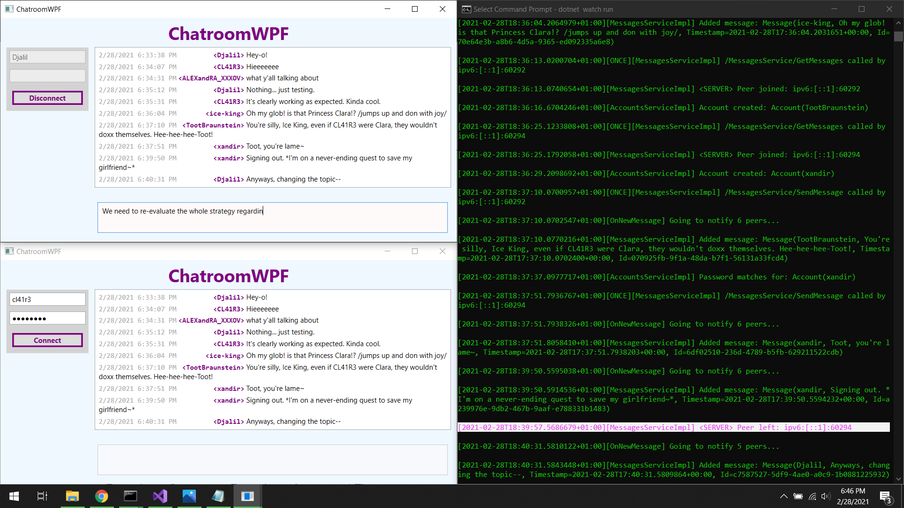

# Univ: CBSE Assignments
CBSE\* assignments / <i lang="fr">Devoirs POC\*\*</i> / RMI / RPC

\* CBSE for _Component-based software engineering_  
\*\* POC for <i lang="fr">Programmation Orientée Composant</i>

## Java RMI: Stock Service

[java-rmi-stock/](./java-rmi-stock/)
- Nothing interesting about it.

---

## Java RMI: Vitals Monitor

"`SmartHospitalRMI`"

The thing I'm proud of is the `VitalSignsRandomizer`, debugging the stub type/class, and rewriting the same console line ("erase characters") ;-;

---

## .NET Remoting: Chatroom

[`dotnet-remoting-chatroom/`](./dotnet-remoting-chatroom).
- I'm kinda proud of the `start-scenario.bat` script...

---

## gRPC (C#.NET & Java): Chatroom

[`grpc-chatroom/`](grpc-chatroom/).

- It's like ".NET Remoting Chatroom," but better and cross-platform.
- It implements something like the Observer pattern using gRPC server streaming.

---

## .NET WCF

...

---

## Java OSGi

...

## License
CC BY 3.0 unless otherwise stated.
