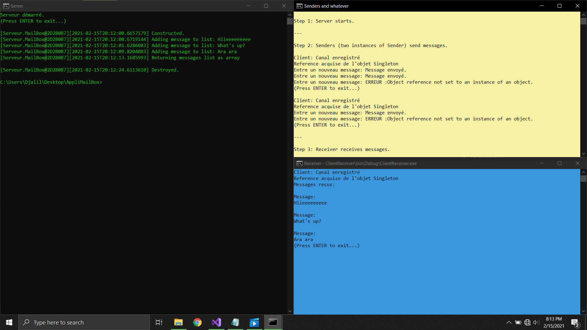
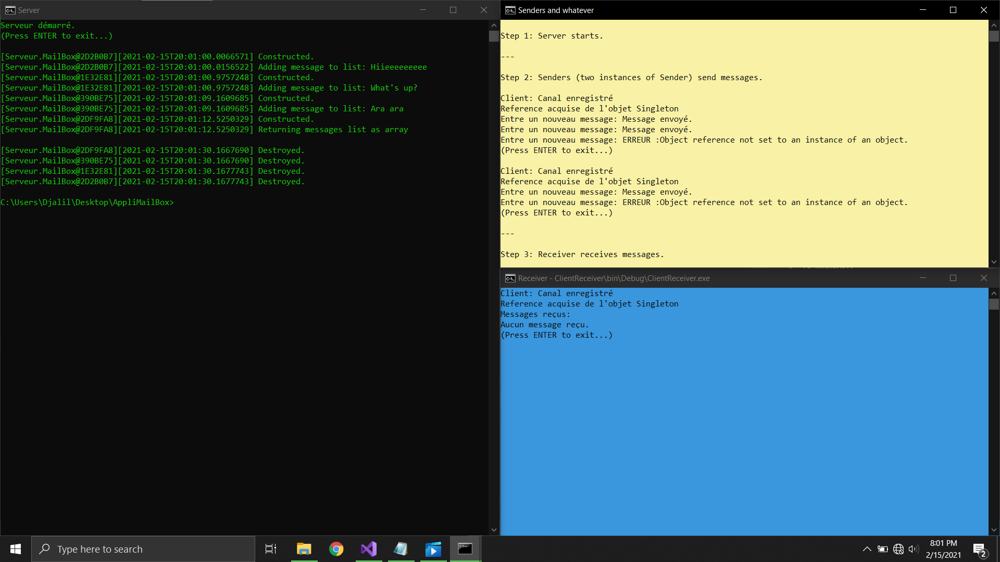
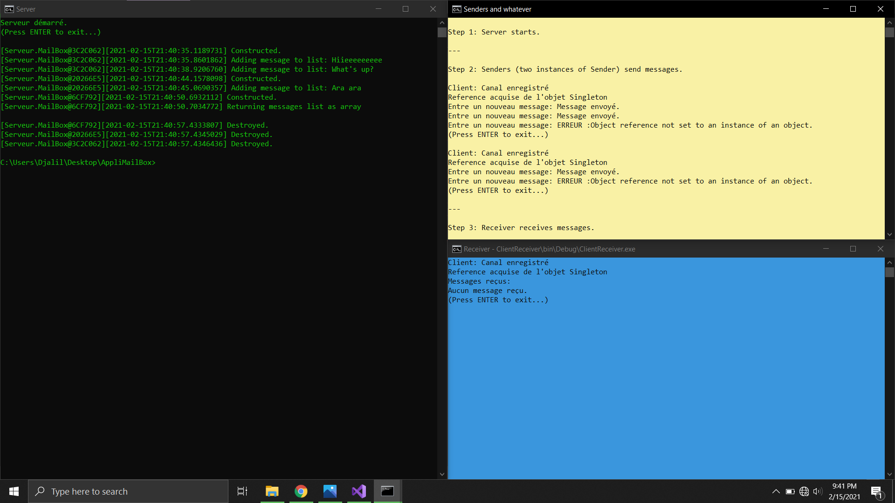

# .NET Remoting Chatroom
.NET Remoting assignment. "POC TP3: AppliMailbox".


## Assignment Text (Paraphrased)

_MailBox_ is a distributed application. It consists of the following components: **Server**, **Sender** Client, and **Receiver** Client.

- Implement these components as console applications.

- Use a `private` `ArrayList` to store messages on the server side.

- Implement the `IMailBox` interface in the Server component and export it on Port `1234`.
```cs
public interface IMailBox
{
    void SendMessage(Message msg);
    Message[] ReceiveMessages();
}
```

- Execute the **Server**, two instances of **Sender**, and then a **Receiver**, with these variations:
  * Using the `Singleton` mode.
  * Using the `SingleCall` mode.
  * Using the _Builder pattern_ to create instances of `MailBox`.

___What do you remark?___


---

## Executing the POC TP3 Scenario

After (re)building the _Solution_, execute the the included batch file (`POC-TP3-start-scenario.bat`).  
It does the following:

- **Step 1:** Starts a Server instance in a separate window (_green_).

- **Step 2 (pt. 1):** Then starts a Sender instance that sends two messages (with a short delay between them):
  * "Hiieeeeeeeee"
  * "What's up?"

- **Step 2 (pt. 2):** Then it starts another Sender instance that sends the third message:
  * "Ara ara"

- **Step 3:** Finally, it starts the Receiver in a new window (_blue_).


## Remarks

### Singleton version
Only one `MailBox` object\* is created (activated by the server) for all clients.  
The _MailBox_' state is shared by the all clients, and that's why the _Receiver_ can read all messages sent by the Senders.

(\* Object ID: `@2D2B...`.)



### SingleCall version
A new `MailBox` object is created (activated by the server) each time a client makes a call.  
In total, 4 instances\* were created for each call even if they were made by the same client.  
Calls are not invoked on the same object, and this is why the Receiver finds an empty list at the end.

(\* Object IDs: `@2D2B...`, `@1E32...`, `@390B...`, and `@2DF9...`.)



### Builder version
A new `MailBox` object is created (activated by the client) each time a client executes `MailBoxBuilder::buildMailBox`.

Instances of `MailBox` obtained using the builder can be shared by the same client.  
In our execution scenario, we only needed 3 instances\* of MailBox for our three clients.  
For example, the first instance of Sender created only one object (`@30E9...`) and used it to send two messages (i.e. two calls).  

Clients don't use the same object, and this is why the Receiver finds an empty list at the end.

(\* Object IDs: `@3C2C...`, `@2026...`, and `@6CF7...`.)



---

## Notes

- **Why not automatically fetch new messages**
  * We could make the Receiver *poll* the Server for new messages every X seconds or, better, implement the Observer pattern, but nah...
  * My introduction of `GetMessagesAfter(Message)`, "message bubbles" (ASCII art?), and logging by themselves are overkill for this simple project.

- No measures have been put into place to handle security, authorization, or authentication.
  This thing is like 4Chan--anonymous, unrestricted, and full of shit.


## License

By @DjalilHebal and @WanisRamdani, under CC BY 3.0.
