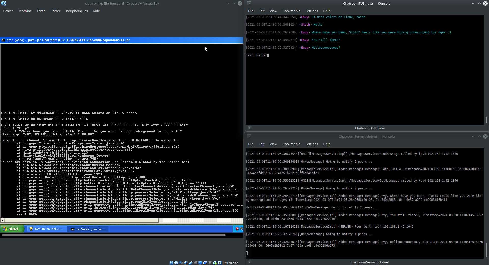

# Ramblings About Network Errors

Consider the following...

---

**MACHINES**:

- **Sankyu**, Linux/Ubuntu 18.04, the "server" (Host No. 39 / `192.168.1.39`).

- **Sloth**: Windows XP machine (virtual, in _bridged networking mode_, has local IP address `192.168.1.42`).

- **Envy**: It's actually the same as Sankyu, but that does not matter. Let's assume it's a separate machine.

---

**SCENARIO**:

- The server (.NET Core) starts.

- Envy (Java client) connects.

- Sloth (Java client) connects.

- Both clients communicate with the server just fine. Notice how Sloth is receiving notifications (Envy's "Where have you been?" was automatically outputted).

- Sloth gets disconnected from the network for a few seconds (I unchecked and then rechecked the "_Connecter la carte réseau_" option in VirtualBox to simulate a brief power outage, kinda~).

- Sloth: The "notifications" stream connection is closed and an exception is thrown.

- Server: Removed their "observer"/stream ("&lt;SERVER> Peer left...").

- Sloth does not automatically re-establish the stream connection (notice that no new "&lt;SERVER> Peer joined" message is logged). Sloth misses new notifications (Envy's "You still here?" and "Hellooo?").

---

You see, gRPC clients do not automatically reconnect to streams, and this is by design. AFAIK--, actually, Eric Anderson has done a great job explaining this case better than I ever could:

> When you receive the error on the client-side, the stream is dead. You should simply create a new RPC using the same Stub/Channel. The Channel will automatically create a new connection to the server, but it can't re-establish any streams.
>
> When load balancing and proxies are involved, a particular stream always goes to the same backend. So if that stream breaks, gRPC can't simply issue a new request automatically, because it can't necessarily get the same backend, and the backend may no longer exist (which is the case when you Ctrl+C the server; when you restart, it is a different server process). So applications should just re-establish the failed stream.

---

**ALSO SEE** (in order of relevance, IMO):

- QUOTE FROM: [[howto] stream auto reconnect? | Google Groups](https://groups.google.com/g/grpc-io/c/PEFwhLXT2wo)

- [Using gRPC for Long-lived and Streaming RPCs - Eric Anderson | YouTube](https://www.youtube.com/watch?v=Naonb2XD_2Q)

- [Long-lived channels and asynchronous calls | Google Groups](https://groups.google.com/g/grpc-io/c/IFalPtNfRtw)

- [Auto-reconnect for Go clients? · Issue #351 | GitHub](https://github.com/grpc/grpc-go/issues/351)

---

END.