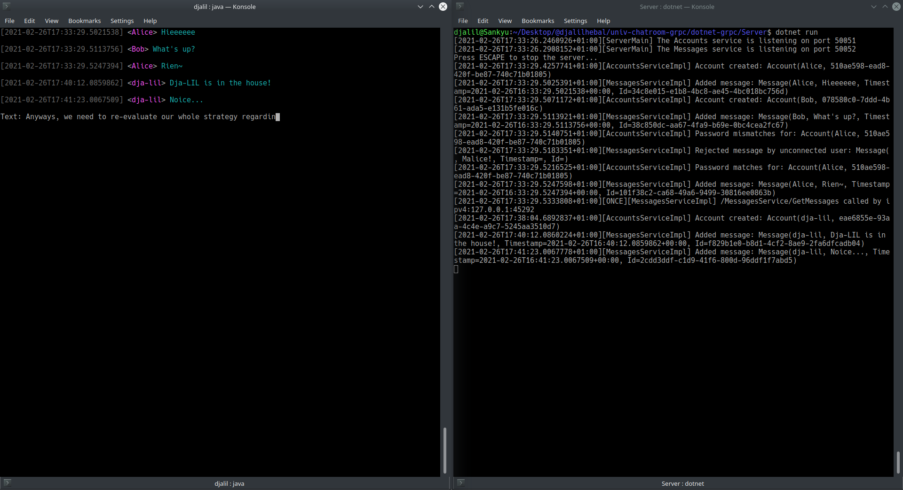

# ChatroomTUI
gRPC Chatroom, Java version.

Tested with:
- Client (Scenario 1): On JDK 8, in Intellij IDEA's Terminal.
- Client (Scenario 2): On JDK 11, in Konsole.
- Server (Scenario 1): On .NET 5.0, Linux/Ubuntu 18.04 (in Konsole, `dotnet run`), localhost.
- Server (Scenario 2): On .NET 5.0, Windows 10, Visual Studio 2019 Community, LAN.




---

## How?

- Add Maven dependencies listed on https://github.com/grpc/grpc-java

- READ: https://grpc.io/docs/languages/java/quickstart/

- READ: https://www.baeldung.com/grpc-introduction


## Compiling proto files (manually)
For whatever reason, the Maven plugin didn't work and automatic generation/building of Java classes failed. Had to do it manually.

1. **Install the Protobuf compiler**
    * [x] `apt install protobuf-compiler` (Version: 3.0.0-9.1ubuntu1)

2. **Install the Java plugin**  
Since we're declaring gRPC dependencies' versions as 1.35.0 (in Maven),
I chosen to use a protoc Java plugin with the same version:
https://mvnrepository.com/artifact/io.grpc/protoc-gen-grpc-java/1.35.0

> Normally you don't need to compile the codegen by yourself, since pre-compiled binaries for common platforms are available on Maven Central:
> 1. Navigate to https://mvnrepository.com/artifact/io.grpc/protoc-gen-grpc-java
> 2. Click into a version
> 3. Click "Files"
> 
> -- https://github.com/grpc/grpc-java/tree/master/compiler

3. Compile `.proto` files
```sh
cd to/src/main/proto

PATH_TO_PLUGIN=protoc-gen-grpc-java-1.35.0-linux-x86_64.exe

SRC_DIR="."
DST_DIR="./generated"
PROTO_FILE="messages_service.proto"

protoc --plugin=protoc-gen-grpc-java=$PATH_TO_PLUGIN -I=$SRC_DIR --java_out=$DST_DIR --grpc-java_out=$DST_DIR $SRC_DIR/$PROTO_FILE
```

4. In your IDE (e.g. Intellij IDEA), make sure to select the `proto/generated/` directory as **\[Auto-Generated] Sources Root**.


## Notes

- To exit, _Control-D_ or _Control-C_.

- To just refresh, press _ENTER_ without typing any text.

- Originally it was supposed to be a JavaFX project, _ChatroomFX_, but I couldn't get it to compile and run.
    Even the starter JavaFX template starts crashing as soon as I add gRPC dependencies to `pom.xml` (JDK 8, Linux/Ubuntu 18.04 and Windows 10 x64). (`java.lang.reflect.InvocationTargetException`).
    This is the reason we ended up using a "text-based UI".  
    As for the name "TUI", I really wanted to make a true "text-based user interface", but it seemed difficult to do, especially when trying to preserve Java's portability...  
    **Jexer** seems cool but I haven't tried it.  
    The current solution is meh but good enough.


- `@klamonte/jexer`: [**Jexer** - Java Text User Interface library - GitLab](https://github.com/klamonte/jexer)

---

END.
