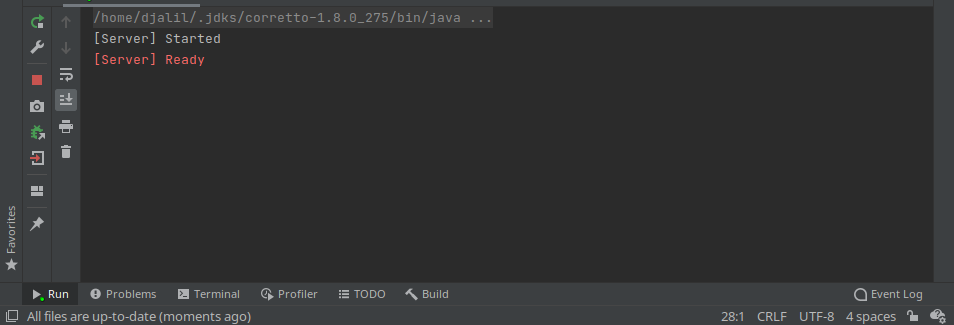
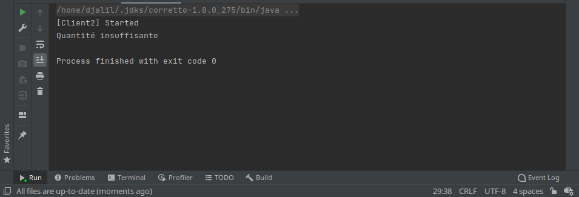
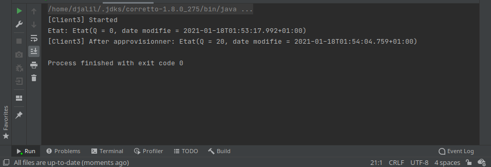
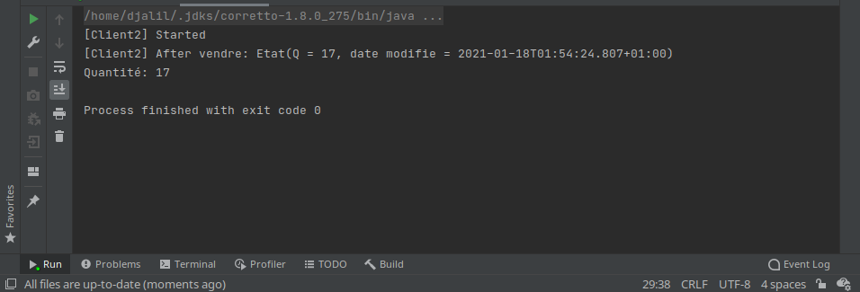
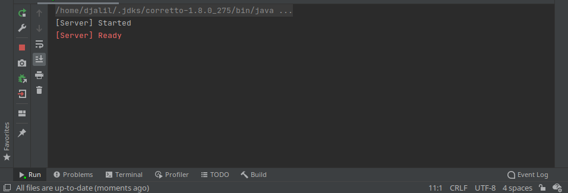
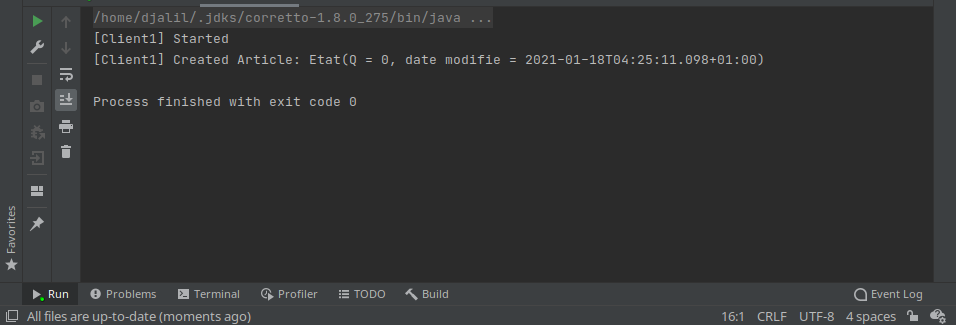
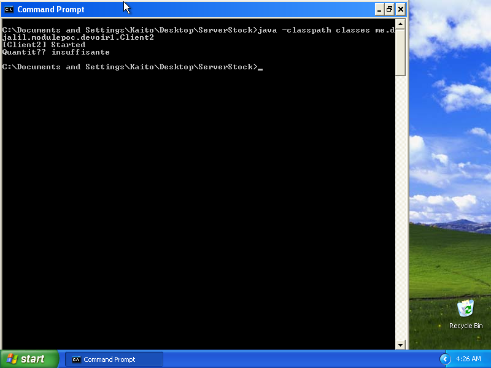

# POC / Devoir 1 / Java RMI

"SmArT SToCk" service using Java RMI.

By:
- @DjalilHebal
- @WanisRamdani

PS: We're well aware that the Java projects contain redundant classes (namely `Article`, `Etat`, `IStock`, and `SmartStockThing`).
We could make the assignment DRY and extract the shared files to a common library, but we decided against it.  
The server's files are the authoritative ones, and clients' are just copies that should be kept in sync.

___The assignment text is expressed as Javadoc comments at the start of each _main_ class and the interface (`StockServeur`, `Client1`, `Client2`, `Client3`, and `IStock`).___


## Running

```cmd
REM Compile all...
javac -d classes src\me\djalil\modulepoc\devoir1\*.java

REM Execute a specific class (e.g. Client2)...
java -classpath classes me.djalil.modulepoc.devoir1.Client2
```

```cmd
REM Run the following command on the Server machine
REM to start the DuckDNS updater for kurage.duckdns.org (hard-coded)...
node -e "require('./kurage/duckdns.js')()"
```


## Scenarios

### Scenario 1

> Exécuter Serveur, Client1, Client2 et Client3 sur la même machine (localhost).

**Machine 1** (Ubuntu 18.04 64-bit, `localhost`): Serveur, Client1, Client2, & Client3.

**Screenshots**:
  1. 
  2. 
  3. 
  4. 
  5. 


### Scenario 2

> Exécuter la séquence d’exécution suivante : Démarrer le Serveur, Client 1, Client 2, Client 3, et enfin Client2.

**Machine 1** (Ubuntu 18.04 64-bit, `192.168.1.39` / San Kyu / Thank You): Serveur & Client1.

**Machine 2** (Windows XP SP3 32-bit, `192.168.1.42` / Shi Ni / To Death): Client2 & Client3.

**Screenshots**:
  1. 
  2. 
  3. 
  4. 
  5. 

---

END.
