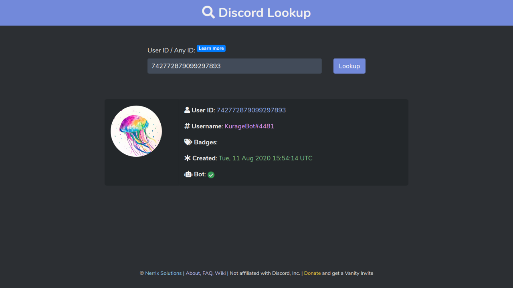

# KurageBot

_PS: Not a public Discord bot._

This is all I needed it to do:
- Start the DuckDNS updater
- Periodically check if the local server is running,
- Update the `#server` channel's description/topic to indicate whether/when the server was last seen online.

Also, just by appearing online, it informs my teammate(s) that they could run tests on my local/"dev" server.

## Credits

Icon: Rainbow Jellyfish by roxypotter13
(https://www.deviantart.com/roxypotter13/art/Rainbow-Jellyfish-596623256)
