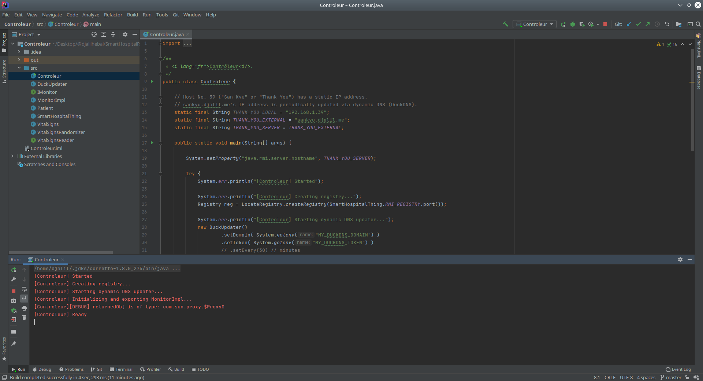
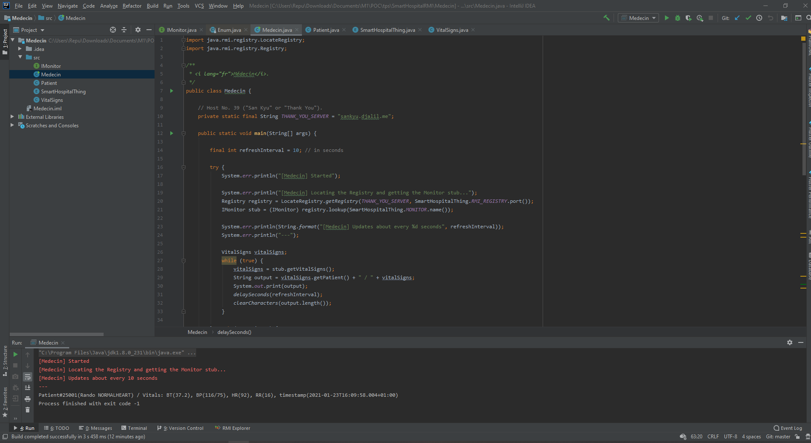

# Java RMI: Vital Signs Monitor
"SmartHospitalRMI" assignment. _#JavaRMI_

Tested scenario 1:
  - **Controleur** - JDK 11, on a local machine (_ThankYou_) running Linux/Ubuntu 18.04 64-bit.
  - **Medecin** - JDK 8, on a local machine (_ToDeath_) running Windows XP SP3 32-bit.

Tested scenario 2:
  - **Controleur** - JDK 8, on a Linux machine (_ThankYou_) in Skikda, Algeria.
  - **Medecin** - JDK 8, on a Windows machine in Souk Ahras, Algeria.


## Answer
_See the "Assignment (verbatim)" section below._

### Steps/Commands

```sh
# Move into the root of the repo
cd SmartHospitalRMI

# Ensure that output directories exist
mkdir -p Controleur/out
mkdir -p Medecin/out

# 3.
# 3.1
javac -d Controleur/out/ Controleur/src/*.java
# 3.2
javac -d Medecin/out/ Medecin/src/*.java

# 4.
rmic -d Controleur/out/ -classpath Controleur/out/ MonitorImpl
# Outputs:
# > Warning: generation and use of skeletons and static stubs for JRMP
# > is deprecated. Skeletons are unnecessary, and static stubs have
# > been superseded by dynamically generated stubs. Users are
# > encouraged to migrate away from using rmic to generate skeletons and static
# > stubs. See the documentation for java.rmi.server.UnicastRemoteObject.

# 5.
cp -f Controleur/out/MonitorImpl_Stub.class Medecin/out/
#REM Windows command:
#copy /Y Controleur\out\MonitorImpl_Stub.class Medecin\out\

# 6.
java -classpath Controleur/out/ Controleur
```

In another terminal (or even on another non-local machine):
```sh
# 7.
java -classpath Medecin/out/ Medecin
```

---

### Remarks

<q lang="fr">**Ne pas effectuer les étapes 4 et 5, que remarquez-vous ?**</q>

First of all, a method with the signature `exportObject()` does not exist in the class `UnicastRemoteObject`.

If we call `UnicastRemoteObject.exportObject(obj)`, we get `StubNotFoundException` (`java.rmi.StubNotFoundException: Stub class not found: MonitorImpl_Stub`) because `exportObject(Remote)` "force uses" a static stub, which we have not compiled with `rmic`.

However, `exportObject(Remote, int)` uses the static stub if it exists, otherwise it uses a dynamically generated stub.  
This is what the JavaDoc comments (and source code) say. Plus, we can check it ourselves with the following lines:
```java
Object retObj = UnicastRemoteObject.exportObject(obj, 42666);
System.err.println("[Controleur][DEBUG] returnedObj is of type: " + retObj.getClass().getCanonicalName());

// if MonitorImpl_Stub exists, it prints the following:
// > "[Controleur][DEBUG] returnedObj is of type: MonitorImpl_Stub"

// if MonitorImpl_Stub does not exist, it prints the following:
// > "[Controleur][DEBUG] returnedObj is of type: com.sun.proxy.$Proxy0"
```

PS: The second argument is the port number. It accepts `0` for a random port.

In the first version, we didn't face this "stub" issue because -- when calling `super()` after extending `UnicastRemoteObject` without passing a port number argument -- it actually passes an implicit `0`,
which is equivalent to calling `UnicastRemoteObject.exportObject(obj, 0)`.

---

### Screenshots

<figure>
  
  <figcaption>"Controleur" program running in Skikda, Algeria.</figcaption>
</figure>

<figure>
  
  <figcaption>"Medecin" program running in Souk Ahras, Algeria and displaying auto-refreshed data from the "Controleur".</figcaption>
</figure>


## Notes

In my opinion, what's kinda cool about this thing is (read: what I want you to notice):

- The fact that we got it to work across the internet.
(See my "chaotic" [`notes/java-rmi-setup-for-external-connections/`](https://djalil.me/notes/java-rmi-setup-for-external-connections)).

- `VitalSignsRandomizer`: A `class` that represents vital signs readings of a <strong>random normal/healthy adult</strong> ("Rando Normalheart"). Nothing wowwy.

- `SmartHospitalThing`: An `enum` To keep shit organized.

- `DuckUpdater`: A fluent API client for DuckDNS (dynamic DNS).

- The _Monitor_/"Controleur" should be deployable to real embedded devices compatible with Java ME (e.g. Raspberry Pi).
This is because we're using only standard features that Java ME 8 supports (which include RMI).

### Considered implementations

- **Idea 0: Real junk**:  
Use real hardware/IoT stuff to read values.

  * _Con_: Ain't nobody got time for dat.

  * _Con_: Have no hardware to begin with.


- **Idea 1: The device _is_ the patient**:  
We could treat the computer/device as if it were a human and read its stats (temperature, CPU load, etc.) and report them as if they were a patient's vital signs (temperature, heartbeats, or whatever).
  
  * Possible mapping:
      + CPU temperature -> Body temperature
      + Network speeds _{download, upload}_ -> Blood pressure _{systolic, diastolic}_
      + ??? -> Heart rate
      + ??? -> Respiratory rate

  * _Con_: Not as easy as it sounds. When I tried to do it, I found lotta "temperatures" and frequencies and whatever. Overwhelming shit.)  
  
  * _Con_: Too complicated, and there was no straightforward way to "cross-platform-ly" obtain these values and without root/elevated privileges.  


- **Idea 2: Vital Signs Randomizer**.  
That's what we're doing.

  * _Pro_: Close enough.


### Possible improvements

- We did not address security at all. We never do. Fix that!

- Common classes/interfaces/enums (`VitalSigns`, `Patient`, `SmartHospitalThing`, and `IControleur`) should be put in a separate place (e.g. a Maven module) and have both apps declare it as dependance.  
Duplicating the same files in both places is totally *ugh* but seemed like an acceptable shortcut for this simple exercise, and I felt it would be better received by the professor.

- Test the vital signs monitor on on embedded systems (e.g. Raspberry Pi) or at least on the Java ME Embedded Emulator.

- We could make it use RMI-IIOP (think: CORBA) and improve interoperability across platforms and languages.
  See:
  * [RMI-IIOP Programmer's Guide | Java Documentation](https://docs.oracle.com/javase/8/docs/technotes/guides/rmi-iiop/rmi_iiop_pg.html)
  * [Tutorial: Getting Started Using RMI-IIOP | Java Documentation](https://docs.oracle.com/javase/8/docs/technotes/guides/rmi-iiop/tutorial.html)


## Assignment (verbatim)

<blockquote lang="fr">

Réaliser une application basée RMI pour l'étude de cas du TP1 « Smart Hospital ».

Nous proposons le scénario suivant : deux applications fonctionnent sur des machines différentes (Contrôleur et Médecin).  
L’application contrôleur est située au lit du patient et à son domicile, permettant ainsi de mesurer l’état
(id_patient, nom_patient, prenom_patient, temp_patient, bat_patient, tens_patient, etc.) d’un patient à
distance.  
L’application médecin située au niveau de l’hôpital, permet au médecin de consulter l’état actuelle
du patient de l'application contrôleur.

Développons l'application « RMI Smart Hospital » en suivant les
étapes suivantes :
1. Créer une classe État et une interface à distance correspondante. La classe État doit être sérialisable.
2. Créez la classe qui fournit l'implémentation de l'interface distante.
3. Compiler tous les fichiers java : javac *.java
4. Créer le stub d'objet (classe d’implémentation) par rmic tool : rmic …
5. Copier le stub généré de l’étape précédente dans le projet client (avec les fichiers .class)
6. Démarrer le serveur dans une autre invite de commande : java MyServer
7. Démarrer l'application cliente dans une autre invite de commande : java MyClient

- Réaliser une deuxième version basée « UnicastRemoteObject. exportObject() » pour l'application « RMI
Smart Hospital». Ne pas effectuer les étapes 4 et 5, que remarquez-vous ?

- Déployer la deuxième version du TP dans deux machines distantes.

</blockquote>


## License

@DjalilHebal and @WanisRamdani, CC BY 4.0.
